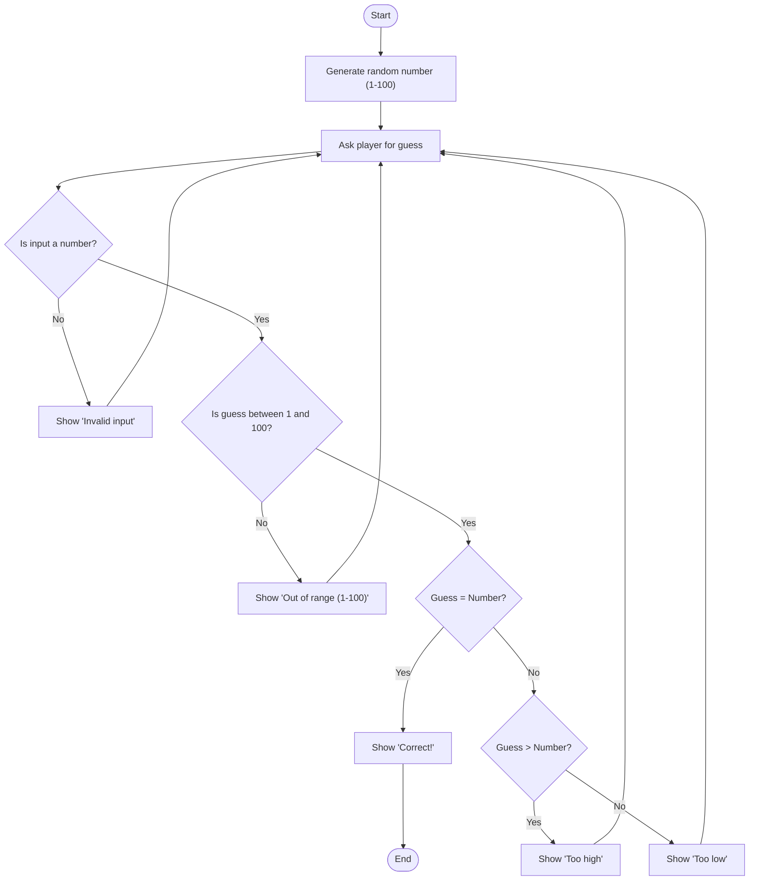

# Guessing Game Flowchart

## Description

Heres how the game works:
- The computer picks a random number between 1 and 100.
- The player guesses a number.
- If the guess is not a number, it says its invalid and it will ask again.
- If the guess is too high or too low, it tells the player.
- If the guess is correct, it ends the game.

---
# Guessing Game Flowchart

# Documentation: 
- Start: Entry point of the process
- Generate: This makes the program generate a random number from 1-100. 
- Guess is where it asks for a user input to guess the number.
- CheckNumber: Checks if the user input is a valid number. If not a number, it displays "Invalid Input" and returns to Guess for another input. If a valid number, it proceeds to the next step.
- CheckRange: Checks if the guessed number is within the valid range (1-100). If the guess is outside the range, it displays "Out of range (1-100)" and returns to Guess for another input.
-  Correct: Compares the guessed number to the generated number. If the guess is correct, the user wins and the process ends.
- If the guess is too high, it displays "Too high" and returns to Guess for another attempt.
- If the guess is too low, it displays "Too low" and returns to Guess for another attempt.

